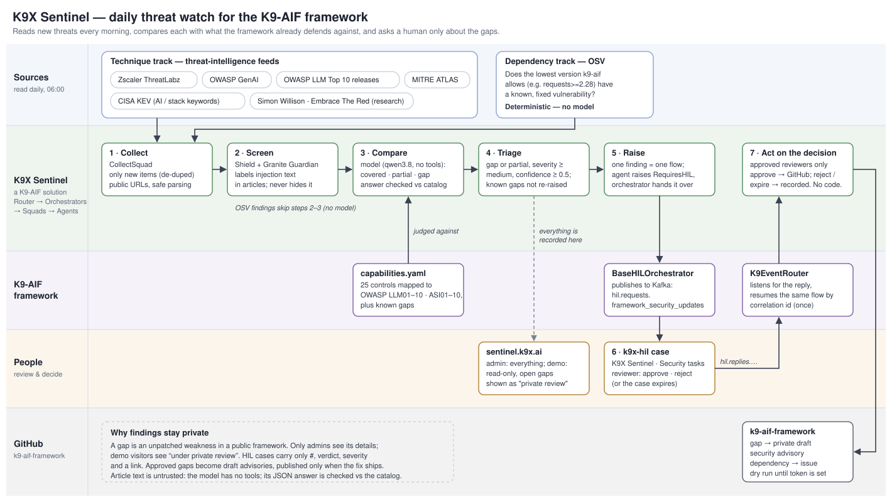

# K9X Sentinel

**A daily threat-intelligence watch for the [K9-AIF](https://github.com/k9aif/k9-aif-framework) framework, built on the framework itself.**

Every morning Sentinel reads the sources security teams actually follow (Zscaler ThreatLabz, OWASP GenAI, MITRE ATLAS, CISA KEV, agent-security researchers, and OSV for the framework's own dependencies). It compares each new threat with what K9-AIF already defends against, and sends the ones the framework doesn't fully cover to a human for review. Approved findings become a private draft security advisory, or an issue for public dependency CVEs, on the framework repository. Sentinel never changes code.



## What it compares against

The framework ships a machine-readable **capability catalog**, `k9_aif_abb/k9_security/capabilities.yaml`. It lists every Shield check, Guardian risk, Zero Trust/identity component, the tool-result guard, router protections and HIL, mapped to OWASP Top 10 for LLM Applications 2025 (LLM01–10) and OWASP Top 10 for Agentic Applications 2026 (ASI01–10), plus the gaps the maintainers already know about. A framework test fails if a control is added without being listed, so Sentinel always judges against what the code actually does.

Sentinel reads the catalog from `SENTINEL_CATALOG_PATH`, else the installed `k9-aif` (1.14.1 and later ship it), else the framework's `main` branch. The UI shows which.

## Two tracks

| Track | Sources | How it decides |
|---|---|---|
| **Dependencies** | OSV | Deterministic, no model. Is the lowest version k9-aif *allows* (`requests>=2.28` → 2.28) affected by an advisory that has a fix? If so: "raise the floor to X". One finding per package and needed floor. |
| **Techniques** | ThreatLabz, OWASP GenAI, OWASP LLM Top 10 and MITRE ATLAS releases, CISA KEV (keyword-filtered), Simon Willison (prompt injection), Embrace The Red | The analysis model returns **covered / partial / gap / not relevant** with OWASP ids, the matching controls, a known-gap link, severity, confidence, rationale and a suggested fix. |

Only *gap* and *partial* findings that are relevant, at least medium severity and at least 0.5 confidence are raised (`config.yaml` → `sentinel.triage`). A threat that is an instance of a known gap is recorded against it, unless it's high severity or above. Everything else stays visible in the UI.

## Security of the bot itself

Sentinel spends its day reading attacker-written content, so it's built to survive that:

- **Fetching:** feeds are parsed with `defusedxml`. Article links are fetched only if every address the host resolves to is public, and every redirect hop is checked too, so a poisoned feed can't point Sentinel at the LAN. Responses are size-capped and reduced to plain text.
- **Screening labels, it doesn't withhold.** Most relevant articles contain live injection examples. Withholding them would blind Sentinel to exactly the threats it exists for. Content is screened with k9x Shield and Granite Guardian, the result is shown on the finding, and the model is told it's analysing (not obeying) flagged text.
- **Containment instead:** the analysis model has no tools. Its answer must be one JSON object, and every OWASP id, capability id and known-gap id is checked against the catalog (unknown ones are discarded). Every raised finding goes to a human.
- **Egress is Shield only.** Granite Guardian classifies *harmful content*, and an accurate analysis of a jailbreak technique reads as harmful to it. Verified live: it blocked every relevant assessment. The analysis agent's egress runs `OutputSanitizationCheck` (markup reaching the UI or GitHub) instead.
- **Private findings:** a gap is an unpatched weakness in a public framework. Only the admin login sees gap details. The optional demo login sees every gap as "under private review" (see *Hosting publicly*), and approved gaps become **private draft** security advisories, not public issues.

## Audit trail and storage

`SENTINEL_DB` in `.env` picks the database:

| `SENTINEL_DB` | Where | Use for |
|---|---|---|
| `sqlite` (default) | `runtime/sentinel.db`, a local file | trying Sentinel out; no setup |
| `postgres` | PostgreSQL, schema `k9sentinel` (`POSTGRES_*` settings) | any real deployment |

Either way, every step is written to an **append-only audit trail** (`audit_events`):
- what was collected;
- how it was screened, with a SHA-256 of the exact text the model read;
- which model and which k9-aif catalog version judged it;
- when it was raised to human review;
- who decided, with their comment;
- decisions ignored because the person isn't an approver;
- what was created on GitHub;
- sign-ins, sign-outs and manual runs.

A database trigger refuses UPDATE, DELETE and TRUNCATE. Each event also stores the hash of the one before it, so **Verify audit chain** (in HIL History) detects an event that was changed or removed by someone who disabled the trigger. **Export audit CSV** gives auditors the whole trail.

**HIL History** lists every finding ever sent for review: when it was raised, how long it has waited (overdue after `SENTINEL_HIL_OVERDUE_DAYS`), the outcome, who decided, their comment and the GitHub result. A case nobody decides is a governance gap, and this view is how an admin asks why.

In PostgreSQL mode the framework's record of open HIL cases (`hil_pending`) lives in the same schema, so the container needs no volume for anything that matters.

## No duplicate review cases

- **Running Sentinel again** never re-sends anything: every item has a stable id per source, and a finding already sent for review is never queued again.
- **The same threat from another source** is compared, before it's raised, with every finding already sent for review (`sentinel/dedup.py`):

| Signal | Result |
|---|---|
| same CVE / GHSA id | duplicate: recorded, linked, not raised |
| same dependency package with a case still open | duplicate: not raised |
| meaning similarity ≥ 0.80 and a shared OWASP id | duplicate: not raised |
| meaning similarity ≥ 0.72 | raised, labelled "possible duplicate of #N" for the reviewer |

Meaning similarity uses the framework's embedding service (Ollama `nomic-embed-text`). On real threat descriptions it scored 0.81–0.88 for the same technique written differently, and 0.54–0.68 for different ones. If the embedding model is unavailable, only the id rules apply: a finding is never blocked because the comparison couldn't run.

## Cost

A model call is the last resort:
- **Pre-filter.** Broad feeds (ThreatLabz) carry a `prefilter:` list of AI terms. An item mentioning none of them is recorded as not relevant without Guardian or the model.
- **Dependencies.** OSV findings never use a model.
- **No repeat assessments.** A finding whose hand-over to k9x-hil failed is re-sent from its stored assessment.

## k9x-hil note (read before going live)

As of this writing, k9x-hil (also served publicly at hil.k9x.ai with a demo login) has two authorization gaps that matter here:

1. Any logged-in user can list and open **every** task (`/tasks` isn't filtered by application membership). Sentinel therefore sends **minimal** cases by default (`SENTINEL_HIL_DETAIL=minimal`): finding number, verdict, severity and a link to Sentinel's login-protected UI.
2. A decision's `actor` comes from the request body, not the login. Anyone logged in can decide **as anyone**. Sentinel acts only on decisions from `SENTINEL_HIL_APPROVERS` (others are ignored and the case is raised again), but that check is only as good as the actor k9x-hil records.

Until k9x-hil takes the actor from the authenticated user and checks membership, keep `SENTINEL_GITHUB_MODE=dry_run`. An approval then only records the exact advisory/issue request, and you create it yourself.

## Run it

```bash
cp .env.example .env              # set OLLAMA_BASE_URL, KAFKA_BROKER, SENTINEL_PASSWORD, ...
python -m venv .venv && . .venv/bin/activate && pip install -r requirements-dev.txt
./run.sh                          # pre-flight, then http://localhost:8114 (sign in with SENTINEL_USER / SENTINEL_PASSWORD)
pytest -q                         # 76 tests, no network or models needed
```

On the Podman host (PowerAI): `ubuntu/build-run.sh all`, then `ubuntu/build-run.sh logs` for the pre-flight and `ubuntu/build-run.sh run` to trigger a run without waiting for 06:00. Port 8114.

### Command line

`tools/sentinel_cli.py` reads a running Sentinel with the admin login from `.env` (stdlib only):

```bash
python3 tools/sentinel_cli.py status            # run state, schedule, catalog, counts
python3 tools/sentinel_cli.py findings          # open gaps / partial gaps (--all, --json)
python3 tools/sentinel_cli.py item 74           # one finding: assessment + audit trail
python3 tools/sentinel_cli.py hil               # every case sent for review
python3 tools/sentinel_cli.py run --wait        # start a run and follow it
python3 tools/sentinel_cli.py report 1          # save run #1's HTML report
```
`SENTINEL_URL` defaults to `https://sentinel.k9x.ai`.

### `/sentinel` in Claude Code

A Claude Code skill turns Sentinel's open findings into verified framework change proposals. The skill is [`claude/skills/sentinel/SKILL.md`](claude/skills/sentinel/SKILL.md); install it once with:

```bash
mkdir -p ~/.claude/skills/sentinel && cp claude/skills/sentinel/SKILL.md ~/.claude/skills/sentinel/
```

| Command | What happens |
|---|---|
| `/sentinel` | reads the open findings (gaps and partial gaps), checks each against the K9-AIF code and capability catalog, proposes changes |
| `/sentinel run` | starts a run, follows it, then does the same |
| `/sentinel 74` | one finding only |
| `/sentinel status` | status and open findings, no analysis |

How it works:
1. **Read:** it calls `tools/sentinel_cli.py` (status, findings, item) with the admin login from `.env`. Set `SENTINEL_URL` there to reach Sentinel directly on the LAN.
2. **Verify:** Sentinel's suggestion is a lead, not a fact. For each finding it finds the framework code the attack would pass through, runs the attack's payloads through the real Shield checks where it can, and quotes file:line.
3. **Propose:** a table of changes (file, which findings each closes, size, catalog update), ordered by risk closed per effort and grouped into a release.
4. **Stop:** nothing is built until you say which changes to make. Building then follows the framework's `CLAUDE.md`: tests, `capabilities.yaml` updated in the same commit, docs, changelog. PyPI only on an explicit go.

It is read-only against Sentinel (except `run`), never approves or rejects review cases, and leaves GitHub actions in dry-run.

The loop it closes: **threat published → Sentinel finds a gap → `/sentinel` proposes the fix → the framework ships it with a catalog entry → the same kind of threat comes back covered.**

### Hosting publicly (demo)

Set `SENTINEL_DEMO_PASSWORD` to enable a read-only viewer; the sign-in page shows its credentials. A viewer sees:
- sources, run stats, the live view, Architecture and About;
- covered, not-relevant and dependency (public CVE) findings in full;
- every **gap and partial gap as "Finding under private review"**: verdict, severity and source only, in the findings list, details, HIL History, audit timeline and the live log;
- no Run now and no audit export (refused by the server).

Before putting it behind a public hostname (for example a Cloudflare tunnel to `localhost:8114`):
- set a strong `SENTINEL_PASSWORD` (the admin sign-in faces the internet; 5 failures lock an address for 5 minutes);
- set `SENTINEL_SESSION_SECRET`;
- set `SENTINEL_PUBLIC_URL` to the public address;
- keep `SENTINEL_HIL_DETAIL=minimal`.

Prerequisites: Ollama with the analysis model (`SENTINEL_MODEL`, default `qwen3.8:27b`) and `granite4.1-guardian:8b` (mandatory, fails closed); Kafka/Redpanda and k9x-hil with the *Framework Security Updates* queue (seeded by k9x-hil at start-up) for HIL.

The UI has a sign-in page (signed, HttpOnly session cookie; 5 failed attempts lock an address for 5 minutes), the findings view, an Architecture tab and an About page for architects (`/about`, public: what Sentinel is, how it keeps K9-AIF current, what to do for an organization, setup). Scripts can still use HTTP Basic with an `X-Sentinel-Client` header (`ubuntu/build-run.sh run`, or `curl -u admin:… -H 'X-Sentinel-Client: me'`); a browser's remembered Basic credentials are ignored.

## Layout

```
sentinel/
  router/sentinel_router.py      SentinelRouter(K9EventRouter): in-process routing + HIL reply listener
  orchestrators/                 ScanOrchestrator, AssessOrchestrator (catches RequiresHIL)
  squads/sentinel_squads.yaml    CollectSquad, AssessSquad, DecisionSquad
  agents/                        collectors, ContentScreen / GapAnalysis / Triage, Decision (+ yaml/ roles)
  sources.py  osv.py             feed readers (SSRF-safe) and the dependency audit
  catalog.py                     loads the framework's capability catalog
  github_actions.py              draft advisory / issue (dry_run by default)
  store.py  runner.py  api.py    SQLite, the daily run + scheduler, FastAPI
  auth.py                        sign-in sessions, lockout
web/                             index.html (app), login.html, about.html, logo.svg, architecture.svg
tools/sentinel_cli.py            command line for a running Sentinel (used by /sentinel)
claude/skills/sentinel/          the /sentinel Claude Code skill
ubuntu/                          Containerfile, build-run.sh
```

## License

Apache-2.0, like the framework.
